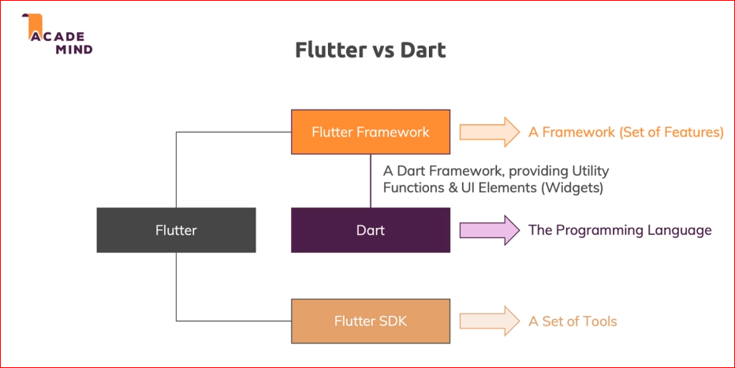
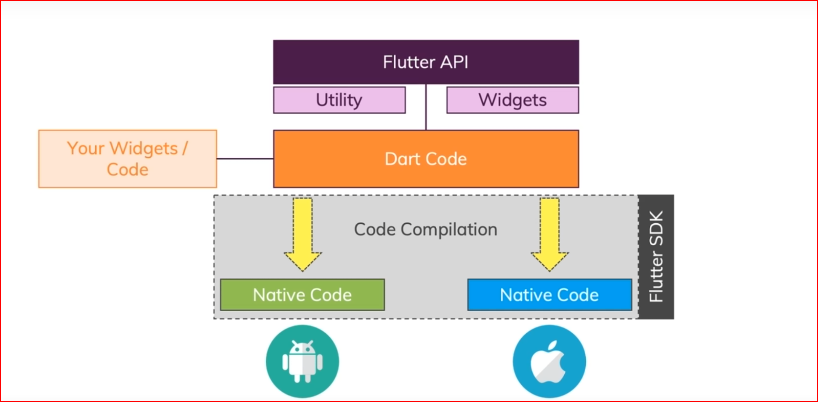
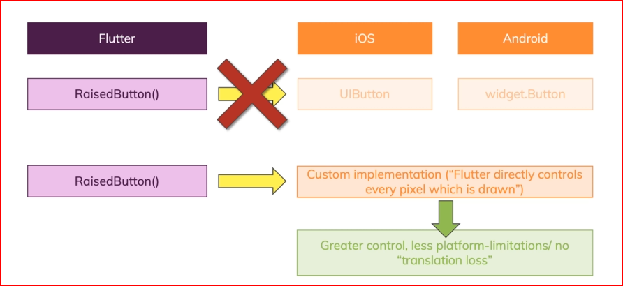
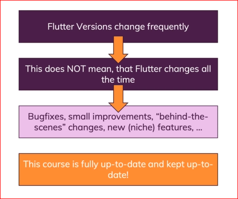
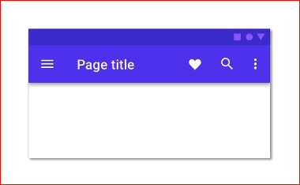
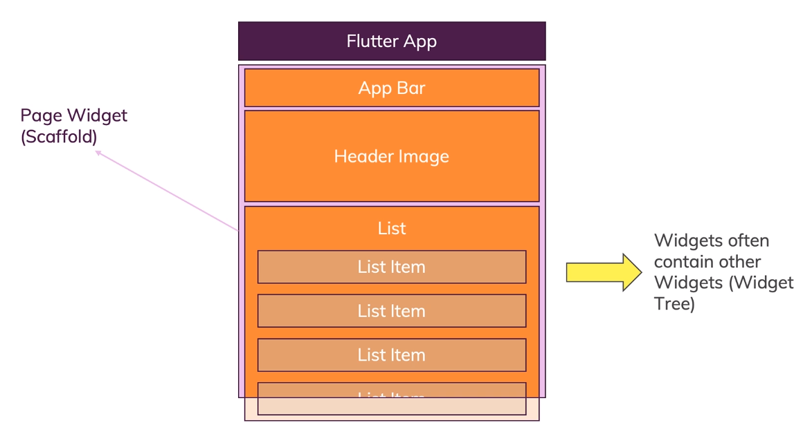
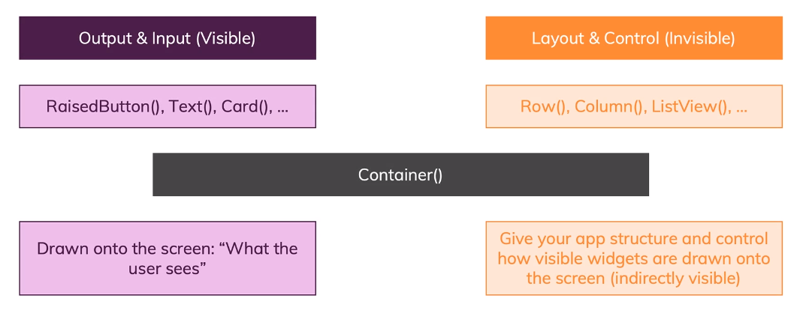

# Flutter

* ## **What is Flutter**
  A **tool** that allows to build ***native cross-platform*** (iOS, Android) apps with ***one programming language*** and ***codebase***.

  

    | Name | Defination |
    |:---:|:---:|
    | A SDK (Software Development Kit) | Tools to compile your code to native machine code + develop with ease |
    | A Framework/ Widget Library | Re-usable UI building blocks (widgets), utility functions packages |

  

  

* ## **Dart**

  Focused on fronted (mobile apps, web) user interface (UI) development.

* ## **Flutter vs Dart**
  

    
  

  
* ## **How is Flutter / Dart transformed to a Native app**
  
  

    
  

* ## **Flutter does not use Platform Primitives**

  

    
  

* ## **Flutter Versions**

  

    
  

* ## **Material Design**

1. Material is a **Design System** created and heavily used by Google.

2. It's NOT Google's Style for Everyone! It is indeed **highly customizable** and works on iOS devices too.

3. Material Design is **built into Flutter** but it also find in Apple-styled (Cupertino) widgets.

  

    
  

* ## **Flutter vs React Native vs Ionic**
  
  

    | Flutter | React Native | Ionic |
    |:---:|:---:|:---:|
    |Dart + Flutter | JavaScript / React.js | JavaScript (any or no Framework) |
    | Compiled native Apps | Partly compiled (UI Components) Native Apps | WebView-hosted Web Apps |
    | Does NOT compile to iOS / Android UI Components | Does compile to iOS / Android UI Components | Does NOT compile to iOS / Android UI Components |
    | Cross-platform (mobile apps, web apps, desktop apps) | Mostly mobile apps + React Native Web | Cross-platform (mobile apps, web apps, desktop apps) |
    | Developed by Google | Developed by Facebook | Developed by Ionic |

    

* ## Widgets

  

    
  

* ## Different types of Widgets

  

    
  
