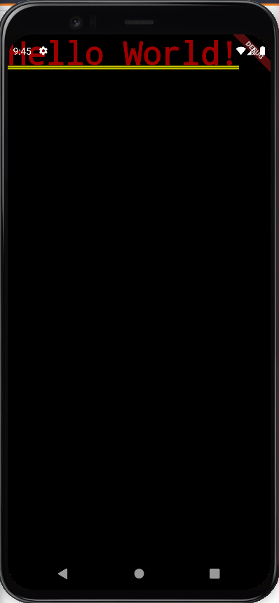

# Components of a Flutter App

* ### `package:flutter/material.dart`

  Flutter widgets implementing <a href="https://material.io/design">Material Design</a>.


* ### `extends`

  In Dart, the `extends` keyword is typically used **to alter the behavior of a class using Inheritance**.  The capability of a class to derive properties and characteristics from another class is called **Inheritance**.
  
  It is **ability of a program to create new class from an existing class**. In simpler words, we can say that we use `extends` to create a **subclass**, and `super` to refer to the **superclass**.

  ```dart
  class Animal {
    Animal(this.name, this.age);
  
    int age;
    String name;
  
    void talk() {
      print('grrrr');
    }
  }

  class Cat extends Animal {
    // use the 'super' keyword to interact with  the super class of Cat
    Cat(String name, int age) : super(name, age);
  
    void talk() {
      print('meow');
    }
  }

  class Dog extends Animal {
    // use the 'super' keyword to interact with  the super class of Cat
    Dog(String name, int age) : super(name, age);
  
    void talk() {
      print('bark');
    }
  }

  void main() {
    var cat = Cat("Tom", 1);
    var dog = Dog("Spike", 2);
  
    dog.talk();
    cat.talk();
  }
  ```

  ```
  meow
  bark
  ```


* ### `widgets`
  
  Describes the configuration for an `Element`.
  
  Each element on a screen of the Flutter app is a `widget`. The view of the screen completely depends upon the choice and sequence of the widgets used to build the app & the structure of the code of an app is a tree of widgets.

  Widgets are the central class hierarchy in the Flutter framework. A widget is **an immutable description of part of a user interface**. Widgets can be inflated into elements, which manage the underlying render tree.

  There are broadly two types of widgets in the flutter: 
  * **Stateless Widget :** A widget that has *mutable state*.
  * **Stateful Widget :** A widget that does not require *mutable state*.


* ### `build()`

  Describes the part of the user interface represented by this `widget`.

* ### `BuildContext`

  A handle to the **location of a widget** in the widget tree.
  
  This class presents a set of methods that can be used from `StatelessWidget.build` methods and from methods on `State` objects.

* ### `context`

  Describes the **part of the user interface** represented by this `widget`.

* ### `runApp()`

  Inflate the given widget and attach it to the screen.

## Example

```dart
import 'package:flutter/material.dart';

void main() {
  runApp(MyApp());
}

class MyApp extends StatelessWidget {
  Widget build(BuildContext context) {
    return MaterialApp(home: Text('Hello World!'));
  }
}
```

Output :-

<p align="center">
    
</p>